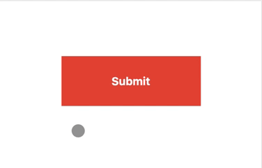

# TimeoutButton

Vue timeout button




## Installation

```
npm install vue-timeout-button
```

```js
import VueTimeoutButton from 'vue-timeout-button';

Vue.use(VueTimeoutButton);
```

## Examples

Simple:
```vue
<TimeoutButton class="red-button"
               @click="submitButton"
               duration="2">
      Submit
</TimeoutButton>
```

Advanced:
```vue
<TimeoutButton class="red-button"
               @click="submitButton"
               @interrupting="clickedWhile"
               @completed="buttonCompleted"
               duration="3.5"
               loading-text="Loading...">
      Submit
</TimeoutButton>
```

Example style of the button
```css
.red-button {
    padding          : 24px 24px;
    background-color : #e74c3c;
    color            : #fff;
    font-weight      : 700;
    position         : relative;
    width            : 200px;
    text-align       : center;
}

.red-button:focus {
    outline : none;
}

.red-button.loading {
    cursor : default;
}
```

## Badges


---

> [pascalhesselink.nl](https://pascalhesselink.nl) &nbsp;&middot;&nbsp;
> GitHub [PascalHesselink](https://github.com/PascalHesselink)
